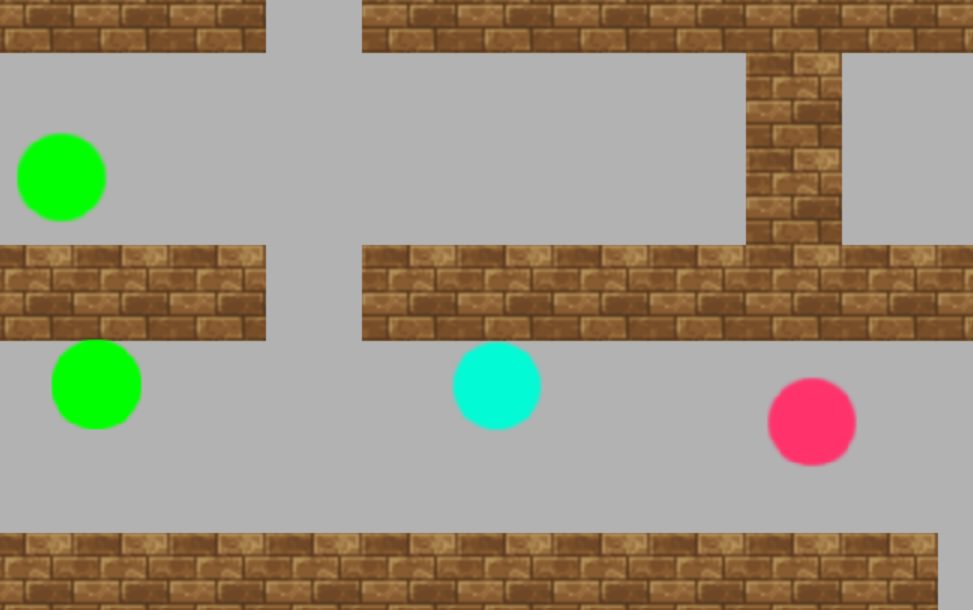

# Fundamentos-de-Teoria-de-Juegos

La Tarea Académica 4 (TA4) consiste en implementar dos variables: Total Humanos que muestre el total de humanos que se encuentran en el nivel actualmente, y Total Zombies que muestre el total de zombies que se encuentran en el nivel. La primera vez que carga el juego total humano debe ser igual a la cantidad de humanos en escena y total zombies igual a la cantidad de zombies. Cada vez que un zombie convierte a un humano en zombie los contadores se deben actualizar, pero sólo se debe mostrar los contadores cuando se presiona la telca 'f'. Si la tecla 'f' no se presiona, sólo se actualizan las variables pero no se muestran, si se presiona la tecla 'f' se mostrarán los contadores actualizados.

**Leyenda de los elementos del juego:**
- Los zombies aparecerán en el mapa como círculos de color verde.
- Los humanos aparecerán en el mapa como círculos de color rosado
- El jugador aparecerá en el mapa como círculos de color celeste
 
**Cómo jugar:** Teclas para jugar/interactuar con el juego
- Arriba = Tecla W
- Abajo = Tecla S
- Derecha = Tecla D
- Izquierda = Tecla A
- Ver contadores = Tecla F
